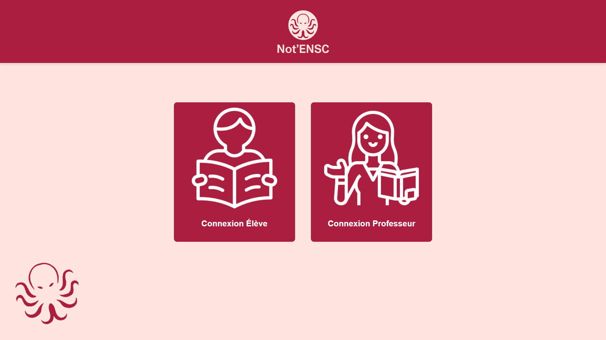

# Not'ENSC
## 📎 Projet Communication Web 2025

## Auteurs

* 👤 [**DERAMAIX Mathilde**](https://github.com/MathildeDrmx)
* 👤 [**HOUT Dounia**](https://github.com/d-hout)
* 👤 [**PAWELCZYK Baptiste**](https://github.com/baptiste5403)

***

<details open="open">
  <summary><h2 style="display: inline-block">Table des matières</h2></summary>
  <ol>
    <li>
      <a href="#à-propos-du-projet">À propos du projet</a>
    </li>
    <li>
      <a href="#prérequis">Prérequis</a>
      <ul>
        <li><a href="#conditions-préalables">Conditions préalables</a></li>
        <li><a href="#installation">Installation</a></li>
      </ul>
    </li>
    <li>
      <a href="#utilisés-dans-ce-projet">Utilisés dans ce projet</a>
    </li>
  </ol>
</details>

<h2 id="à-propos-du-projet">À propos du projet</h2>



## Consulter ses notes

Notre projet consiste en la réalisation d'une application web garantissant la **gestion de notes d'une école** 🎓.

L'application permet une connexion différenciée selon si l'on est un élève 👨‍🎓 ou un professeur 👩‍🏫. Un utilisateur se connecte avec son identifiant et son mot de passe.

Un élève a accès seulement à ses notes 📚 sur les différentes matières. Les enseignants 👨‍🏫 ont accès seulement à leurs notes (celles des cours qu’ils donnent) pour la classe entière 👥 ou pour les groupes sélectionnés.

<h2 id="prérequis">Prérequis</h2>

Retrouvez les prérequis à effectuer afin de pouvoir lancer le projet.

<h3 id="conditions-préalables">Conditions préalables</h3>

Nous avons utilisé **React** qui est un framework JavaScript nécessitant un compilateur JS, nous avons choisi **Node.js** pour cela.
Nous avons également utilisé **XAMPP** en ce qui concerne la gestion des bases de données pour faire notre API dans un premier temps en local, avant de basculer vers un hébergement sur le serveur zzz de Bordeaux INP.

* [Installer Node.js](https://nodejs.org/)

<h3 id="installation">Installation</h3>

1. Cloner le dépôt sur votre machine personnelle, à l'aide de [Git](https://git-scm.com/downloads) ou en téléchargeant les fichiers manuellement (flèche verte puis "Download ZIP")
   ```
   git clone https://github.com/d-hout/projet_comweb_Hout_Deramaix-Pawelczyk.git
   ```

2. Se diriger vers le répertoire du projet dans l'**invite de commande**
   ```
   cd projet_comweb_Hout_Deramaix-Pawelczyk
   ```

3. Lancer l'application web
   ```
   npm install
   npm run dev
   ```

4. Observer le rendu avec l'adresse **localhost** donnée

<h2 id="utilisés-dans-ce-projet">Utilisés dans ce projet</h2>

| JavaScript      | Applications       |
| :-------------: | :--------------:   |
| Node.js         | XAMPP              |
| Vite            | Visual Studio Code |
| React           | Git / GitHub       |